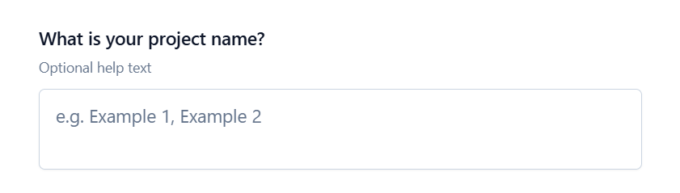
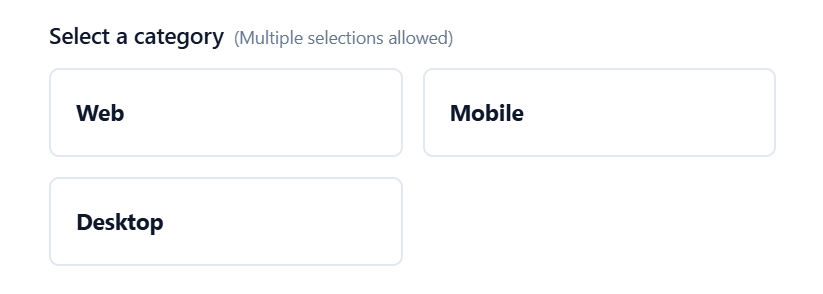
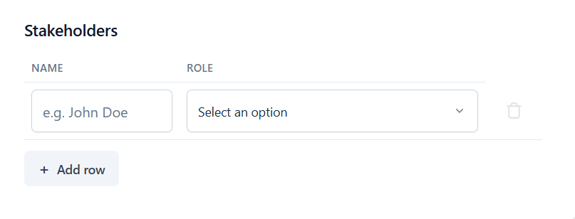
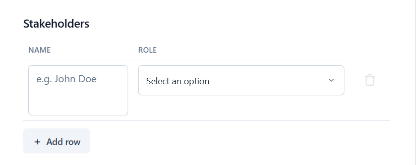
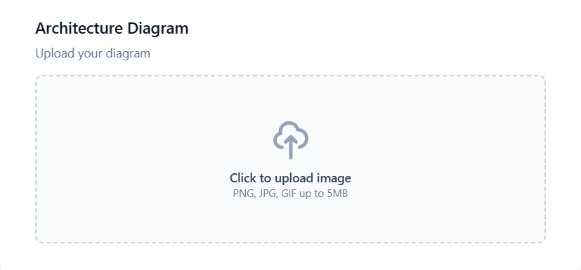

# GateWize User Guide

Welcome to GateWize! This guide will help you understand how to create, manage, and use these intelligent forms.

## Overview

The system allows you to build complex forms with various question types, ranging from simple text inputs to detailed tables and image uploads. What makes these forms "AI-Powered" is their ability to:

*   **Provide Real-time Feedback**: As users fill out the form, AI evaluates their answers against specific criteria.
*   **Rate Responses**: The AI can rate responses (e.g., "Good", "Partial", "Missing") and offer improvement suggestions.
*   **Guide Users**: Custom prompts help guide users to provide high-quality information.

## 1. Creating a Form (Admin Guide)

Forms are created and managed via the **Admin Panel**.

### Accessing the Admin Panel
Navigate to the \`/admin\` route of your application. You will see two main sections:
1.  **Spec JSON (Left)**: An editor where you define the form structure using JSON.
2.  **Preview (Right)**: A live preview of how the form looks and behaves.

### Methods to Create a Form

You have three ways to start:

1.  **New Form**: Click the "New Form" button to start with a blank slate.
2.  **Use Template**: Click "Use Template" to load a comprehensive example showing all features. **Recommended for beginners.**
3.  **Upload JSON**: If you have an existing form file (`.json`), click "Upload JSON" to load it.

### Workflow
1.  **Edit**: Modify the JSON in the editor. The "Preview" pane updates automatically (as long as the JSON is valid).
2.  **Validate**: The system checks for syntax errors (red) and schema issues (orange). Fix these before saving.
3.  **Save**: Click the "Save" button in the Preview toolbar.
    *   **First Save**: You will be asked to confirm the form name.
    *   **Auto-Save**: Subsequent changes are auto-saved as you type (after a short delay).

### Managing Forms
*   **Load**: Use the dropdown menu in the toolbar to switch between saved forms.
*   **Delete**:
    *   **Current Form**: Click the trash icon next to the "Save" button.
    *   **Multiple Forms**: Click "Manage Forms" to select and delete multiple forms at once.

---

## 2. JSON Specification Reference

The form is defined by a JSON object called `FormSpec`. Here is the structure:

### Root Object (`FormSpec`)
```json
{
  "name": "My Form Name",        // Unique identifier
  "status": "draft" | "published", // Controls visibility
  "description": "Optional form description",
  "sections": []                 // List of sections
}
```

### Section Object
Groups related questions together.
```json
{
  "title": "Section Title",
  "description": "Optional section description",
  "questions": []                // List of questions
}
```

### Question Types

There are four question types.

#### 1. Simple Question (`simple`)
Standard text input.
```json
{
  "type": "simple",
  "question": "What is your project name?",
  "description": "Optional help text",
  "examples": ["Example 1", "Example 2"],
  "multiple": false,             // true for multiple text inputs
  "promptConfig": { ... }        // AI configuration
}
```




> **Note**: You can allow users to provide multiple answers by setting the `"multiple"` flag to `true`. This enables adding multiple text inputs for a single question.


#### 2. Option Question (`option`)
user selects from a list.
```json
{
  "type": "option",
  "question": "Select a category",
  "options": ["Web", "Mobile", "Desktop"],
  "multiple": true,              // Allow multiple selections
  "justification": true          // Ask 'Why?' if selected
}
```



>**Note**: You can allow users to provide multiple answers by setting the `"multiple"` flag to `true`. This enables adding multiple text inputs for a single question.

#### 3. Detailed Question (`detailed`)
A table for complex data entry.
```json
{
  "type": "detailed",
  "question": "Stakeholders",
  "attributes": [
    {
      "name": "name",
      "description": "Full Name",
      "width": 0.3,              // Column width (0.0 - 1.0)
      "examples": ["John Doe"],
      "inputType": "textarea"    // Optional: 'input' or 'textarea'
    },
    {
      "name": "role",
      "description": "Role",
      "options": ["User", "Admin"], // Renders as dropdown
      "promptConfig": { ... }
    }
  ]
}
```




> **Note**: Free text attributes (those without options) can be configured as a simple `input` or a `textarea` using the `inputType` property. The default is `input`.


> **Important**: An attribute cannot have both `options` and `examples`. Use `options` for a dropdown menu, OR `examples` for a text input with hints.

##### Column Width distribution
The system uses a smart logic to distribute column widths:
*   **Equal Split**: By default, all columns share the available width equally.
*   **Custom Widths**: If you specify a width (e.g., `0.3` for 30%), that column is guaranteed that space.
*   **Automatic Repartition**: Any remaining space is divided equally among the columns *without* a specific width.
> **Note**: The sum of all specific widths must not exceed 1 (100%).

#### 4. Image Question (`image`)
For uploading or linking images.
```json
{
  "type": "image",
  "question": "Architecture Diagram",
  "description": "Upload your diagram",
  "url": "https://..."           // Default/Placeholder URL
}
```



---

## 3. Configuring AI (PromptConfig)

You can customize how the AI evaluates responses using `promptConfig`. This is available on `simple` questions and `detailed` attributes.

```json
"promptConfig": {
  "task": "Evaluate if the project name is professional.",
  "role": "You are a naming expert.",
  "guidelines": "Check for clarity and professionalism. Avoid slang."
}
```

*   **task**: What the AI should actually do.
*   **role**: The persona the AI should adopt.
*   **guidelines**: Specific rules or criteria for the evaluation.

**Note**: If no `promptConfig` is provided, the system uses a default generic evaluator.

---

## 4. Using the Form (User Guide)

When a user fills out the form:

1.  **Real-time Rating**: As they type and move to the next field, the AI quietly checks their answer.
2.  **Feedback Indicators**:
    *   Users might see subtle indicators (colors or icons) if an answer is rated.
    *   **Comments**: If the AI has suggestions, a comment bubbles up (or is accessible via an icon).
3.  **Improvement**: Users can edit their answers based on the feedback. The AI re-evaluates the new answer.

### Best Practices for Users
*   **Be Specific**: The AI often looks for detailed, specific answers rather than vague ones.
*   **Check Examples**: Look at the provided examples (if any) to understand the expected format.
*   **Read Feedback**: If the AI suggests an improvement, consider it to increase the quality of your submission.
